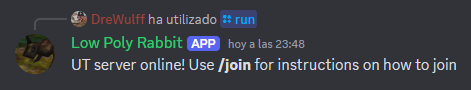

# Server Manager: Unreal Tournament 99
## Description
A Discord bot written in Python for launching and managing an Unreal Tournament 99 server in Windows.  
Commands are explained in the [Commands](#discord--commands) section, and can be seen with a brief explanation during runtime by typing `/help` in the chat of the server it is in.

||
|:--:|
|*Bot at work*|

> [!WARNING]
> **Its use is recommended for small Discord servers as it relies on sharing the public IP of the machine in which the UT99 server is running to the user through an ephemeral message for direct connection.**

## Setup
Download and extract the latest release, or clone this repository in the root folder of your installation of Unreal Tournament with the following command:

    git clone https://github.com/DreWulff/UT99ServerManager-DiscordBot

Make sure all libraries/modules required are installed.

Create a `.env` file with the next lines, replacing the values in brackets:

    DISCORD_TOKEN=[Token from your Discord bot]
    DISCORD_GUILD=[Name of Discord server]
    INI_FILE_NAME=[.ini file for UT99 server]

> [!NOTE]
> To obtain the token you must first have a Discord app/bot. To get started I would recommend to follow the official Discord Developer Portal documentation in [Building your first Discord app](https://discord.com/developers/docs/quick-start/getting-started).

## Run
To start the bot execute the command:

    python bot.py

## Discord `/` Commands
* `/run [mode] [players] [map=Random]`:
  * Launches a server with the desired gamemode.
  * The server will be filled with bots as to satisfy the amount of players specified as a minimum.
  * Only one server can be launched by the bot at any time.
  * The map is selected at random as a default, but can be optionally specified.

* `/maps [mode]`:
  * Shows the user a list of the available maps for a certain gamemode.

* `/stop`:
  * Stops the currently running server.

* `/join`:
  * Shows the user that sent the command an ephemeral message that indicates the current public IP and port of the running server, alongside instructions to join.

* `/help`:
  * Shows the user that sent the command an ephemeral message that explains each command supported by the bot.

## Notes
* The bot checks if certain files are present to see what gamemodes and maps are available.

* The configurations of the server are defined by the .ini file given to it, and to determine which file to use its name can be pointed out in the `INI_FILE_NAME` field in the `.env` file. By default it uses `UnrealTournament.ini` which is the file used by the game when playing.
